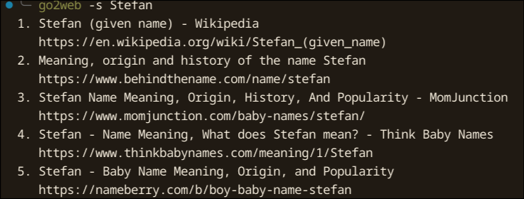
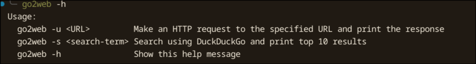
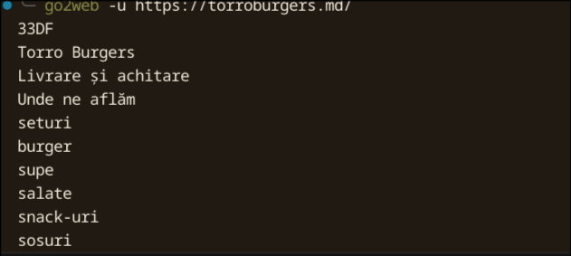

# CLI HTTP Client – Laboratory Report

## Overview

This laboratory involved building a command-line HTTP client that can fetch and process web content using low-level networking in Python.

## Features Implemented

- **HTTP GET Method**  
  Constructed raw HTTP GET requests manually following the HTTP/1.1 protocol.

- **URL Parsing**  
  Used `urllib.parse` to extract scheme, hostname, port, and path from the URL.

- **Socket Communication**  
  Established TCP connections using the `socket` module, with optional SSL encryption via `ssl` for HTTPS requests.

- **Redirect Handling**  
  Followed HTTP redirects (301, 302, etc.) by parsing the `Location` header and making recursive requests with a redirect limit.

- **Caching with Hashing**  
  Used SHA-256 hashing (`hashlib`) to convert URLs into safe and unique filenames.  
  Cached responses in a local `.go2web_cache/` directory to avoid redundant network calls.

- **Response Parsing**  
  - Detected `Content-Type` to determine how to process the response.
  - Parsed HTML with `BeautifulSoup` to extract readable text.
  - Parsed JSON content and formatted it using `json.dumps`.

## Screenshots

### Command: `go2web -s`

  
This screenshot shows the command `go2web -s`, which starts the server mode of the tool.

### Command: `go2web -h` (Help)

  
This screenshot displays the output of the `go2web -h` command, showing the available options and usage.

### Command: `go2web -u` (URL Fetch)

  
This screenshot shows the output of the `go2web -u` command used to fetch content from a URL.

## Summary

This lab provided practical experience with HTTP protocol internals, socket-based networking, content parsing, and cache management. It reinforced understanding of how web clients interact with servers at a low level.
